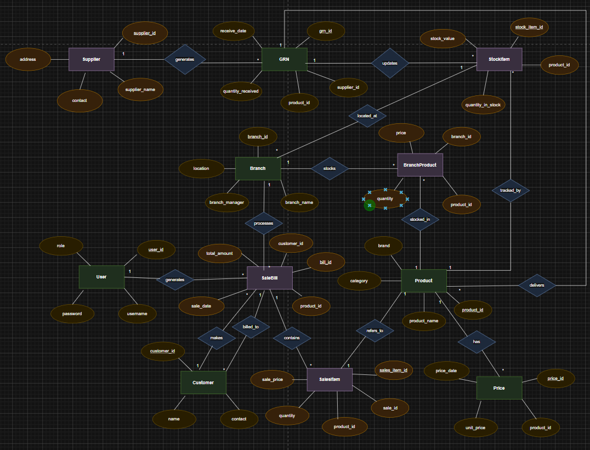
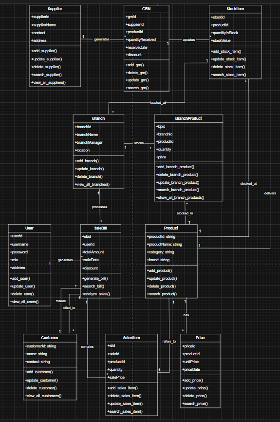
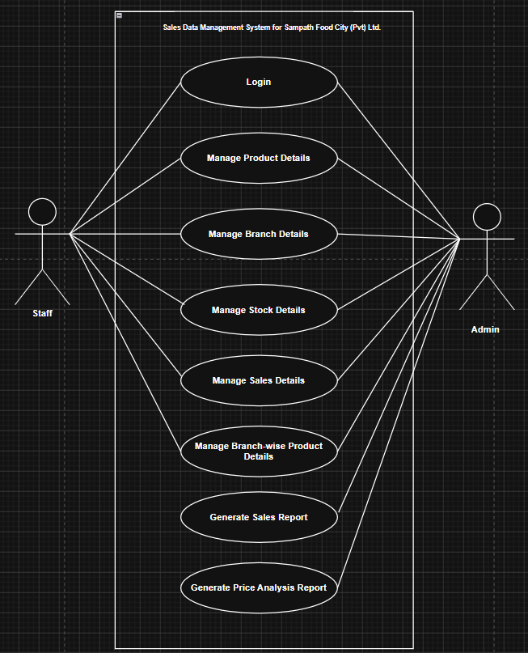

# 🏪 Inventory & Sales Management System

## Private Backend Development Project

A Python-based Inventory and Sales Management System designed to manage business operations including products, suppliers, stock, branches, customers, sales transactions, and reporting.

The system provides a structured backend solution using Object-Oriented Programming principles and database connectivity to support daily business activities.

---

# 📌 Project Overview

Managing inventory manually can cause problems such as:

- Incorrect stock tracking
- Difficulty managing suppliers
- Sales record issues
- Product availability problems
- Lack of centralized information

This system provides a computerized solution to manage business data efficiently.

The application handles:

- Product management
- Supplier management
- Stock management
- Branch management
- Customer management
- Sales processing
- Price management
- Reporting

---

# 🎯 Project Objectives

The main objectives are:

- Automate inventory operations
- Maintain accurate stock information
- Manage sales transactions efficiently
- Store business information systematically
- Provide easy data access and management
- Reduce manual record handling

---

# 🏗 System Architecture

The system follows an object-oriented backend structure.

```
User

 ↓

Application Layer

 ↓

Manager Classes

 ↓

Database Connection

 ↓

Database

```

---

# ⚙️ Core System Modules

## 📦 Product Management

Handles product-related operations.

Features:

- Add product
- Update product details
- Delete product
- View products
- Search products


Managed by:

```
ProductManager.py
```

---

# 🏭 Supplier Management

Manages supplier information.

Features:

- Add suppliers
- Update supplier details
- Remove suppliers
- View supplier records


Managed by:

```
SupplierManager.py
```

---

# 📦 Stock Management

Controls inventory availability.

Features:

- Add stock
- Update quantity
- Remove stock
- Check available items


Managed by:

```
StockManager.py
```

---

# 🏪 Branch Management

Handles company branches.

Features:

- Create branches
- Update branch details
- Delete branches
- Manage locations


Managed by:

```
BranchManager.py
```

---

# 🔗 Branch Product Management

Controls product availability across branches.

Features:

- Assign products to branches
- Manage branch stock
- Track product distribution


Managed by:

```
BranchProductManager.py
```

---

# 💰 Sales Management

Handles customer purchases and transactions.

Features:

- Create sales
- Store sales details
- Calculate total amount
- Update inventory after sales


Managed by:

```
SalesManager.py
```

---

# 👥 Customer Management

Stores customer information.

Features:

- Add customer
- Update customer details
- Delete customers
- View customer records

---

# 💵 Price Management

Manages product pricing.

Features:

- Add prices
- Update prices
- Delete prices
- Search prices

---

# 📊 Reporting Module

Generates business information.

Provides:

- Sales reports
- Inventory reports
- Product reports
- Business summaries


Managed by:

```
ReportManager.py
```

---

# 🗄 Database Design

The database contains connected entities:

Main tables:

```
User

Customer

Sales

Product

Price

Stock

Supplier

Branch

BranchProduct

```

Relationships:

```
Supplier
    |
    supplies
    |
 Product
    |
    has
    |
 Price


Customer
    |
    makes
    |
 Sales
    |
    contains
    |
 Product


Branch
    |
    manages
    |
BranchProduct
    |
    stores
    |
 Stock

```

---

# 📐 System Diagrams

## ER Diagram

The Entity Relationship diagram shows database entities and their relationships.




---

## Class Diagram

The class diagram shows the object-oriented structure of the system.

It represents:

- Classes
- Attributes
- Methods
- Relationships





---

## Use Case Diagram

The use case diagram explains how users interact with the system.

Actors:

- User
- System Administrator


Main activities:

- Manage products
- Manage suppliers
- Manage stock
- Process sales
- Generate reports




---

# 🛠 Technologies Used

## Programming Language

- Python


## Concepts

- Object-Oriented Programming
- CRUD Operations
- Database Management


## Development Tools

- Visual Studio Code


## Database

- SQL Database Connectivity

---

# 📂 Project Structure

```
Inventory-System/

│
├── BranchManager.py
│
├── BranchProductManager.py
│
├── ProductManager.py
│
├── StockManager.py
│
├── SupplierManager.py
│
├── SalesManager.py
│
├── ReportManager.py
│
├── DBConnection.py
│
├── finalproject.py
│
├── test_finalProject.py
│
├── test_productManager.py
│
├── diagrams/
│
│   ├── ER_Diagram.png
│   ├── Class_Diagram.png
│   └── UseCase_Diagram.png
│
└── README.md

```

---

# 🔄 System Workflow

```
User Login

      ↓

Main Menu

      ↓

Select Operation

      ↓

Manager Module

      ↓

Database Update

      ↓

Display Result

```

---

# ▶ How To Run

Install required dependencies:

```
pip install -r requirements.txt
```

Run application:

```
python finalproject.py
```

---

# 🔐 Project Privacy

This is a private software development project.

Source code, database structure, and documentation are maintained privately.

---

# 🚀 Future Improvements

Possible improvements:

- Web-based frontend
- User authentication system
- Role-based access control
- Cloud database integration
- Advanced reporting dashboard
- Barcode scanner integration
- Mobile application

---

# 👨‍💻 Developed By

Inventory & Sales Management System Built ❤️ by <a href="https://github.com/IleeshaUdari"><strong>M.G.Ileesha Udari Sasmitha</strong></a>

```
